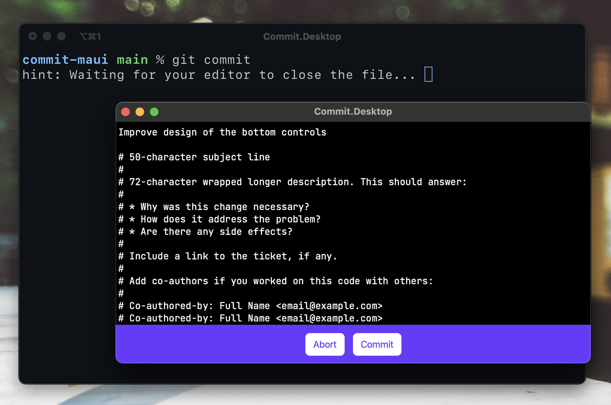

# commit

Commit is an editor that helps you write better Git commit messages on MacOS and Windows.

## TODO

- [ ] Improve look & feel including a proper light and dark theme
- [ ] Write documentation on how to use Commit
